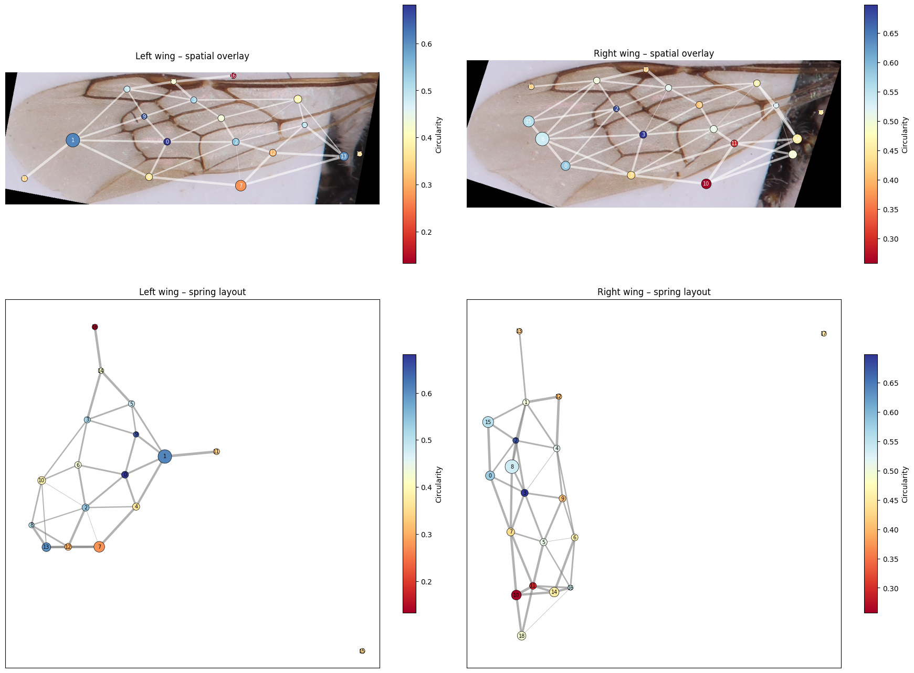
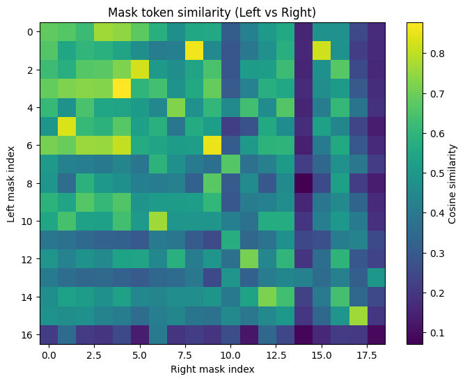
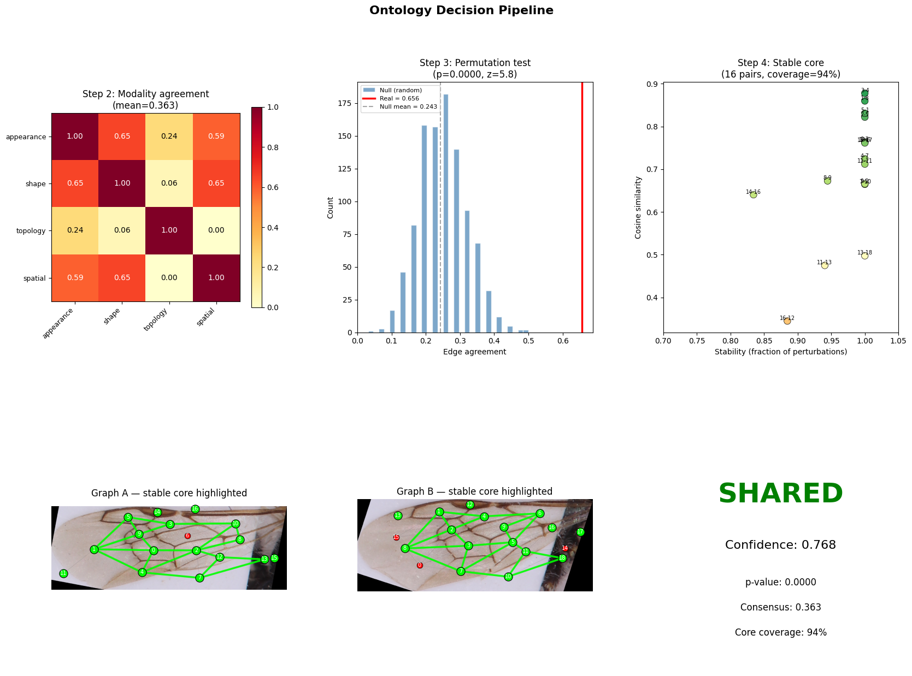
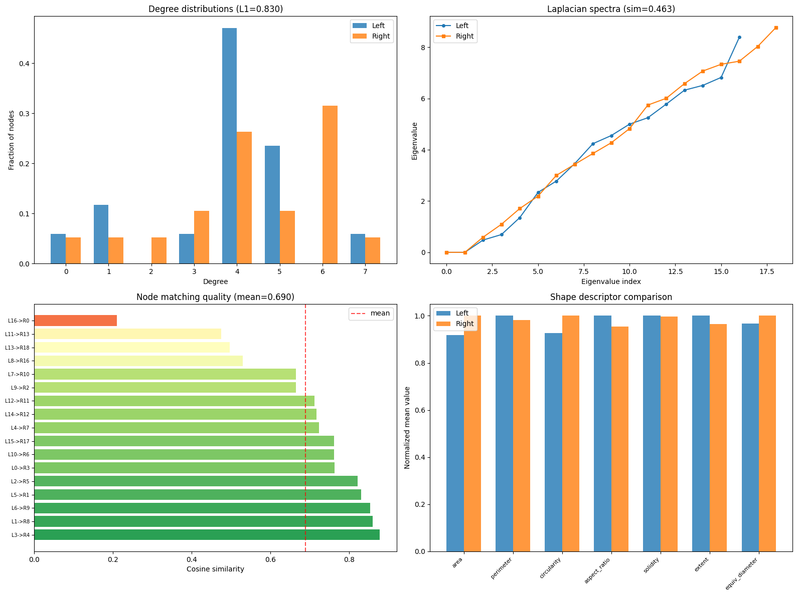

# Big Bee: Wing Ontology and Instance Segmentation

## Overview
Big Bee is a research toolkit for advanced analysis of bee wing images, focusing on robust segmentation, feature extraction, and graph-based ontology generation. The project leverages state-of-the-art models (Segment Anything, DINOv2) to extract meaningful biological and morphological information from high-resolution images of bee wings.

## Key Features
- **Automated Instance Segmentation:** Uses Meta's Segment Anything Model (SAM) for precise mask generation of wing cells.
- **DINOv2 Embeddings:** Extracts deep visual features for each segmented region, enabling robust comparison and matching.
- **Graph-Based Ontology:** Constructs a graph (nodes = wing cells, edges = adjacency) for each wing, encoding both geometric and learned features.
- **Robust Adjacency Logic:** Latest update ensures only directly adjacent (touching) regions are connected, preventing spurious indirect links and improving biological interpretability.
- **Structural and Morphological Comparison:** Compares left/right wings (or different specimens) using graph statistics, spectral analysis, and node/edge matching.
- **Visualization:** Provides clear visualizations of segmentation, graph structure, and comparison metrics.

## Latest Developments
- **Improved Edge-Building:** Edges are now created only when two regions' boundaries directly touch, eliminating indirect A-B connections via a shared neighbor. This results in more accurate and biologically meaningful wing graphs.
- **Enhanced Comparison Metrics:** Includes degree distribution, spectral similarity, node matching via DINOv2, and edge agreement for rigorous left/right or specimen-to-specimen analysis.


## Usage
1. **Prepare Images:** Place cropped/rotated bee wing images in the `data/cropped_rotated/` directory.
2. **Run Notebooks:** Use `ontology_generation.ipynb` for full pipeline: segmentation, feature extraction, graph construction, and comparison.
3. **Outputs:**
    - Segmentation masks and cutouts in `cutouts/`
    - Embeddings in `output_masks/`
   # Big Bee: Wing Ontology & Analysis

   ## Project Overview
   `big-bee` is a toolkit for extracting, representing, and comparing the detailed structure of insect (bee) wings. The pipeline converts high-resolution wing images into graph-based ontologies where:

   - Nodes = segmented wing cells (individual mask regions)
   - Edges = direct adjacency between regions (shared mask boundary)

   The pipeline integrates the Segment Anything Model (SAM) for high-quality automatic instance segmentation and DINOv2 for semantic embeddings. Geometric and topological features are extracted per region, a robust adjacency graph is constructed, and rigorous graph-comparison metrics are computed to quantify similarity between wings.

   This README explains the pipeline, documents the latest changes (especially the adjacency logic), and walks through the representative figures stored in `figures/` so you can interpret outputs quickly.

   ## Key goals and recent improvements
   - Produce biologically meaningful wing graphs that reflect actual cell adjacency, not artefacts of bounding-box overlap.
   - Use learned visual features (DINOv2 embeddings) to find node-level semantic matches across specimens.
   - Provide quantitative graph comparison metrics (structural, spectral, and node/edge agreement) and visualize them clearly.
   - Latest improvement: robust adjacency detection that connects regions only when their boundaries directly contact, preventing spurious A–B connections introduced by a shared neighbor C.

   ## Quick start

   1. Create and activate an environment (example using conda):

   ```bash
   conda create -n big-bee python=3.10 -y
   conda activate big-bee
   pip install -r requirements.txt
   ```

   2. To run the full pipeline (recommended in Jupyter):

   ```bash
   jupyter lab
   # open and run `ontology_generation.ipynb`
   ```

   3. Output locations:

   - `cutouts/<image_name>/` — saved cutout PNGs for each segment
   - `output_masks/<image_name>/out.ome_mask_tokens.npy` — saved DINOv2 embeddings per region
   - `figures/` — representative final plots (explained below)

   Note: Running the entire pipeline requires a GPU for reasonable speed (DINOv2 and SAM inference).

   ## Pipeline summary (what each stage does)

   1. Segmentation (SAM)
       - Automatic mask generation for each input image.
       - `process_masks()` filters masks by area, removes duplicates (IoU threshold), extracts and saves cutouts.

   2. Embedding extraction (DINOv2)
       - Each cutout is resized to 224×224 and passed through DINOv2 to produce a fixed-length embedding vector.

   3. Geometric feature extraction
       - Extracts area, centroid, perimeter, circularity, aspect_ratio, solidity, extent, and equivalent diameter for each mask.

   4. Adjacency detection (robust update)
       - Previous approach relied on bounding-box overlap and dilated mask contact, which sometimes produced A–B edges when A and B both overlap C.
       - New approach: compute mask boundary maps and only add an edge for pair (A, B) if their boundaries directly contact by at least `min_boundary_contact` pixels (default = 5). This reduces false-positive edges and yields a graph that better reflects true anatomical adjacency.

   5. Graph construction
       - Nodes: per-mask features and embedding (for downstream matching)
       - Edges: adjacency pairs with `boundary_contact`, `connection_strength`, and `centroid_distance` stored as attributes

   6. Graph comparison
       - Structural stats: node/edge counts, density, avg degree, clustering coefficient, diameter, avg path length
       - Degree distribution L1: L1 distance between normalized degree histograms
       - Spectral similarity: compare Laplacian eigenvalues after padding, produce spectral L2 and similarity
       - Node matching: greedy maximum-similarity pairing using DINOv2 cosine similarities (global greedy, no reuse)
       - Edge agreement: proportion of left-wing edges preserved after mapping nodes to the right wing

   ## Figures in `figures/` (detailed description and interpretation)

   Below are the key figures included in the repository with guidance on how to read each.

   ### 1) `figures/ontology_generation.png`

   <p align="center"></p>

   - What it contains:
      - Top-left: modality agreement heatmap used for multi-modal fusion (appearance/shape/topology/spatial).
      - Top-middle: permutation-test histogram showing the null distribution of edge agreement; the red line marks the observed score. Large separation indicates significance.
      - Top-right: stability plot showing node stability (fraction of perturbations where a match persists) vs cosine similarity; labeled points indicate node indices in the stable core.
      - Bottom-left/right: the two wing graphs with stable-core nodes and connections highlighted.
      - Right-hand panel: textual decision block (e.g., SHARED), with confidence, p-value, consensus, and core coverage.

   - How to interpret:
      - Use the permutation test to validate whether observed edge agreements are likely under a random pairing null model.
      - Nodes with both high stability and high similarity are strong candidates for shared anatomy (stable core).

   ### 2) `figures/similarity_matrix.png`

   <p align="center"></p>

   - What it contains:
      - Heatmap of cosine similarities between DINOv2 embeddings for left vs right masks. Rows are left masks; columns are right masks.

   - How to interpret:
      - Bright diagonal or column-major patterns indicate clear one-to-one matches.
      - If many left rows show low similarity to any right column, that left region may be missing or unmatched.
      - Use this plot to visually inspect problematic matches flagged in the notebook.

   ### 3) `figures/ontology_similarity.png`

   <p align="center"></p>

   - What it contains:
      - Degree distribution comparison (bar): shows fraction of nodes with each degree for both graphs; reports L1 distance.
      - Laplacian spectra plot: sorted Laplacian eigenvalues for each graph; spectral similarity is shown in the title.
      - Node matching quality: horizontal bar chart of matched pairs sorted by cosine similarity, with mean similarity marked.
      - Shape descriptor comparison: normalized mean values for shape descriptors across the two wings.

   - How to interpret:
      - Degree L1 quantifies difference in connectivity — 0 is identical.
      - Similar Laplacian spectra suggests similar global structure.
      - Node match quality gives a per-match confidence breakdown.

   ### 4) `figures/feature_comparison.png`

   <p align="center"></p>

   - What it contains: normalized comparison of core shape descriptors (area, perimeter, circularity, aspect_ratio, solidity, extent, equivalent diameter).

   - How to interpret:
      - Descriptor bars close to each other indicate morphological similarity for that feature.
      - Large differences highlight which physical features differ the most between specimens.

   ## How to reproduce the figures quickly

   If you already have precomputed embeddings and masks in `output_masks/` and `cutouts/`, you can reproduce plotting cells only (fast). If not, run segmentation + embedding extraction first.

   Run (example):

   ```bash
   # run full notebook (may take a while; requires GPU)
   jupyter nbconvert --to notebook --execute ontology_generation.ipynb --inplace --ExecutePreprocessor.timeout=0

   # or open the notebook and run plotting cells interactively
   jupyter lab
   ```

   To save the currently shown figures to `figures/` automatically, add `plt.savefig('figures/<name>.png', dpi=150)` right after figure creation in the plotting cells.

   ## Tunable parameters and where to edit them

   - `process_masks()` (notebook):
      - `area` filter (min area for valid regions)
      - `iou_threshold` for duplicate suppression
   - `compute_adjacency()` (notebook):
      - `min_boundary_contact` — increase to require stronger direct boundary contact (reduces spurious edges)
   - Node matching:
      - `top_k` when inspecting alternate matches in similarity matrices

   ## Troubleshooting

   - If DINOv2 or SAM models fail to load, verify that you have the correct PyTorch/CUDA setup and internet access (or cached models in `~/.cache/torch/hub`).
   - If graphs are too dense, increase `min_boundary_contact` or inspect mask cleaning steps (`get_cutout()` and morphological operations).
   - If many nodes are unmatched, visualize `cutouts/<image_name>/` to confirm segmentation quality.

   ## Development & Contributions

   - Primary files:
      - `ontology_generation.ipynb` — main pipeline; recommended place to reproduce experiments
      - `segment_wing.py`, `segment_wing_augmented.py` — helper segmentation scripts
   - If you modify core algorithms (adjacency, embedding handling), please add a small test or notebook cell to demonstrate correctness on one sample image.

   ## Citation

   If you use this repository in research, please cite:
   - the Segment Anything Model (SAM) (paper & repo)
   - DINOv2 (paper & repo)

   And consider referencing this repository repository for the pipeline-specific methods.

   ---
   For questions or contributions, please open an issue or a pull request.

